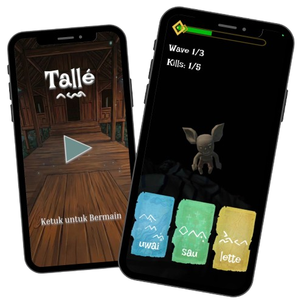

<!-- 

<h1>Tallé</h1>

<em>A Lontara Spell-Casting AR Game</em>

 -->

    

    <em>Tallé - An Aksara Lontara Spell-Casting AR Game</em>

---

# About
Tallé hadir dari keresahan bahwa banyak bahasa dan aksara daerah di Indonesia mulai ditinggalkan generasi muda, termasuk aksara Lontara dari budaya Bugis-Makassar. Melalui game mobile berbasis AR dan voice recognition, Tallé mencoba menghadirkan cara belajar budaya yang lebih dekat dengan generasi digital: bukan sekadar membaca sejarah, tetapi ikut berpetualang, mengucapkan mantra Lontara, dan merasakan langsung nilai budaya dalam pengalaman bermain yang interaktif dan imersif.

    

Download Sekarang: https://github.com/HainzelK/HantuProject/releases

## Minimum Requirements
- Android 7+, ARCore-supported device
- Camera & Microphone Permission
- Mid-Range 2019+ chipset recommended

## Playing Instructions
> [!TIP]
> Direkomendasikan untuk bermain di area yang cukup terang dan terbuka untuk pengalaman main bermain yang lebih baik

1. Arahkan kamera ke arah musuh. Panah indikator akan membantu menunjukkan posisi musuh yang berada di luar field of view.
2. Pilih kartu *spell* yang ingin digunakan.
3. Bacakan mantra yang tertera di bawah kartu untuk mengaktifkan *spell*.

## Technologies Used
- Game Engine: Unity 6.0 60f1, AR Foundation
- Speech Recognition: Google Teachable Machine
- 3D Game Asset: Blender
- GUI Game Asset: Figma

## Gameplay Preview
<!-- drag and drop di github -->

    <video src="https://github.com/user-attachments/assets/dd2ceabe-72cd-4cad-a894-3422f0551304" style="width: 65%; height: auto">

## Dev Team Overview
1. Hainzel Kemal - Team Lead & Lead Developer
2. Ivone Liwang - 3D Generalist (3D Artist & Asset Creator)
3. Aaron Jevon Benedict Kongdoh - Gameplay & Systems Developer
4. Deny Wahyudi Asaloei - 3D Generalist (3D Artist & Asset Creator)
5. Aryo Karel Merentek - UI/UX Designer & Front-End Developer

  

made with ❤️ from the hantuproject team
